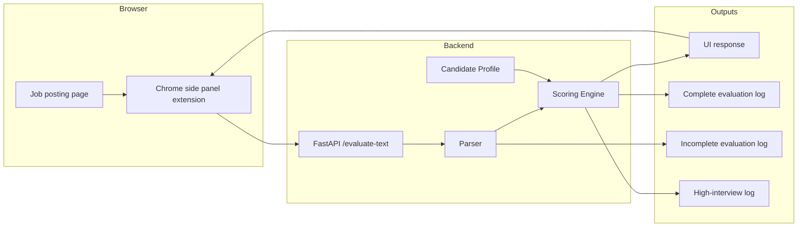
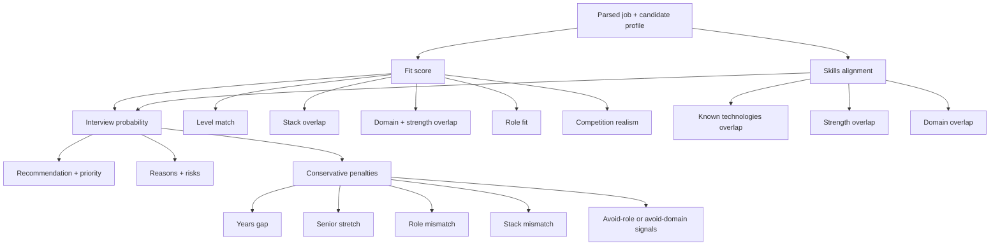

# find-jobs

`find-jobs` is a local, rule-based tool for evaluating job postings against a candidate profile.

It is being developed iteratively for real job-search use, so the priority is fast reviewer onboarding, explainable scoring, and small, testable changes.

## Reviewer setup

This project uses `uv` for dependency management and command execution.

If `uv` is not installed:

- macOS or Linux: `curl -LsSf https://astral.sh/uv/install.sh | sh`
- Homebrew: `brew install uv`
- Windows: `powershell -ExecutionPolicy Bypass -c "irm https://astral.sh/uv/install.ps1 | iex"`

After installation, restart your shell if `uv` is not yet on your `PATH`.

## Quick start

From the repository root:

```bash
uv sync
uv run pytest
uv run find-jobs evaluate tests/fixtures/affirm_backend_engineer.txt
```

Run the local API:

```bash
uv run uvicorn find_jobs.api:app --host 127.0.0.1 --port 8000 --reload
```

Sanity-check it:

```bash
curl -s http://127.0.0.1:8000/health
```

Test the plain-text endpoint:

```bash
curl -s \
  -X POST http://127.0.0.1:8000/evaluate-text \
  -H "Content-Type: text/plain" \
  --data-binary @tests/fixtures/affirm_backend_engineer.txt
```

Use FastAPI docs for manual testing:

- open `http://127.0.0.1:8000/docs`
- use `POST /evaluate-text`
- paste a full job description

## What it does

Current inputs:

- raw job description text from files, API requests, or the Chrome extension

Current parser outputs:

- title
- company
- location
- years of experience
- salary range and currency when present
- seniority
- role type
- technologies
- domain signals
- work style signals

Current scoring outputs:

- fit score
- skills alignment
- interview probability range
- years of experience match
- recommendation
- priority
- reasons
- risks
- factor breakdown
- missing-field diagnostics for incomplete parses

Current surfaces:

- CLI
- local FastAPI API
- Chrome side panel extension

## Project structure

- `src/find_jobs/cli.py`: CLI entrypoint
- `src/find_jobs/api.py`: FastAPI wrapper
- `src/find_jobs/parser.py`: job text parsing
- `src/find_jobs/profile.py`: candidate profile defaults
- `src/find_jobs/comparison.py`: parse + score orchestration
- `src/find_jobs/scoring/engine.py`: final score assembly
- `src/find_jobs/scoring/fit/`: fit scoring helpers
- `src/find_jobs/scoring/skills/`: skills scoring helpers
- `src/find_jobs/scoring/interview.py`: interview probability scoring
- `src/find_jobs/scoring/shared.py`: shared scoring helpers
- `src/find_jobs/models.py`: shared models
- `tests/`: behavior contract
- `tests/fixtures/`: real-world parsing fixtures
- `extension/`: Chrome extension client

## System design

The system is intentionally split into a thin browser client and a local scoring backend:

- the Chrome extension extracts visible job text and displays the result
- FastAPI is the scoring boundary
- the parser turns messy job text into structured fields
- the scoring engine compares those fields against the candidate profile
- logs feed calibration and regression testing



## Scoring notes

The scoring system is intentionally heuristic and explainable.

The scorer separates three different questions instead of collapsing everything into one number:

| Metric | What it means | Main inputs | Why it exists |
|---|---|---|---|
| Fit | Is this worth spending time on? | Level match, stack overlap, domain fit, role fit, competition realism | Helps decide apply / consider / skip |
| Skills | How much technical overlap is there? | Technologies, strengths, domain signals | Separates capability overlap from hiring realism |
| Interview | How likely is a cold application to convert? | Fit, skills, years match, role fit, penalties | Models screening odds conservatively |

Fit includes a few small specialization-aware lifts when the candidate profile directly proves a niche domain match.

Interview probability is calibrated against the active candidate profile, not just the job posting. Years-of-experience penalties are based on the gap between the parsed job requirement and the candidate profile. Specialized domain proof can relieve pessimism for roles that would otherwise look too niche from generic signals alone.

### Scoring overview



## Review logs

The project writes review queues under `logs/`:

- `logs/complete_evaluations.jsonl`: every completed evaluation
- `logs/incomplete_evaluations.jsonl`: evaluations with missing parsed fields or parser warnings
- `logs/high_interview_evaluations.jsonl`: evaluations whose interview upper bound clears the configured threshold, plus `apply/high` roles that should be reviewed even when the interview cap stays below it

Overrides:

```bash
FIND_JOBS_COMPLETE_LOG_PATH=/custom/path/complete.jsonl
FIND_JOBS_INCOMPLETE_LOG_PATH=/custom/path/incomplete.jsonl
FIND_JOBS_HIGH_INTERVIEW_LOG_PATH=/custom/path/high-interview.jsonl
FIND_JOBS_HIGH_INTERVIEW_THRESHOLD=20
```

## Chrome extension

To test the extension locally:

1. Install `uv` if needed, then run `uv sync`.
2. Start the local API.
3. Open `chrome://extensions`.
4. Enable `Developer mode`.
5. Click `Load unpacked`.
6. Select the `extension/` directory.
7. Open a job posting.
8. Open the `find-jobs` side panel.
9. Click `Evaluate Job`.
10. Expand `Preview extracted text` if the result looks wrong.
11. Check `logs/high_interview_evaluations.jsonl` or `logs/incomplete_evaluations.jsonl` when you want calibration candidates.

## Example output

```text
Title: Software Engineer
Company: PathPilot
Fit Score: 84
Skills Alignment: 79
Interview Probability: 14-20%
Years Match: Strong match: requires about 3 years, profile is 3 years.
Recommendation: apply
Priority: high
Reasons:
- Role type aligns well with your target focus (backend).
- Job content matches several of your strongest backend and systems skills.
- Domain signals overlap well with your preferred backend and integration work.
- Relevant stack overlap found: aws, python, rest-apis.
```

## Status

This is an actively iterated local tool, not a finished platform. Expect small refactors, scoring calibration, and workflow changes as real job-review usage exposes gaps.
